Mini Data Analysis Milestone 2
================
Jérôme Plumier

- [Welcome to the rest of your mini data analysis
  project!](#welcome-to-the-rest-of-your-mini-data-analysis-project)
- [Instructions](#instructions)
- [Learning Objectives](#learning-objectives)
- [Setup](#setup)
- [Task 1: Process and summarize your
  data](#task-1-process-and-summarize-your-data)
  - [1.1 Research Questions (1 point)](#11-research-questions-1-point)
  - [1.2 Summarizing and Graphing (8
    points)](#12-summarizing-and-graphing-8-points)
  - [1.3 Research Questions Progress (2
    points)](#13-research-questions-progress-2-points)
- [Task 2: Tidy your data](#task-2-tidy-your-data)
  - [2.1 Tidy or untidy? (2 points)](#21-tidy-or-untidy-2-points)
  - [2.2 Untidy, then tidy again (4
    points)](#22-untidy-then-tidy-again-4-points)
  - [2.3 Research Questions Selection (4
    points)](#23-research-questions-selection-4-points)
- [Task 3: Modelling](#task-3-modelling)
  - [3.0 (no points)](#30-no-points)
  - [3.1 Hypothesis (3 points)](#31-hypothesis-3-points)
  - [3.2 Production (3 points)](#32-production-3-points)
- [Task 4: Reading and writing data](#task-4-reading-and-writing-data)
  - [4.1 (3 points)](#41-3-points)
  - [4.2 (3 points)](#42-3-points)
- [Overall Reproducibility/Cleanliness/Coherence
  Checklist](#overall-reproducibilitycleanlinesscoherence-checklist)
  - [Coherence (0.5 points)](#coherence-05-points)
  - [File and folder structure (1
    points)](#file-and-folder-structure-1-points)
  - [Output (1 point)](#output-1-point)
  - [Tagged release (0.5 point)](#tagged-release-05-point)
    - [Attribution](#attribution)

*To complete this milestone, you can either edit [this `.rmd`
file](https://raw.githubusercontent.com/UBC-STAT/stat545.stat.ubc.ca/master/content/mini-project/mini-project-2.Rmd)
directly. Fill in the sections that are commented out with
`<!--- start your work here--->`. When you are done, make sure to knit
to an `.md` file by changing the output in the YAML header to
`github_document`, before submitting a tagged release on canvas.*

# Welcome to the rest of your mini data analysis project!

In Milestone 1, you explored your data. and came up with research
questions. This time, we will finish up our mini data analysis and
obtain results for your data by:

- Making summary tables and graphs
- Manipulating special data types in R: factors and/or dates and times.
- Fitting a model object to your data, and extract a result.
- Reading and writing data as separate files.

We will also explore more in depth the concept of *tidy data.*

**NOTE**: The main purpose of the mini data analysis is to integrate
what you learn in class in an analysis. Although each milestone provides
a framework for you to conduct your analysis, it’s possible that you
might find the instructions too rigid for your data set. If this is the
case, you may deviate from the instructions – just make sure you’re
demonstrating a wide range of tools and techniques taught in this class.

# Instructions

**To complete this milestone**, edit [this very `.Rmd`
file](https://raw.githubusercontent.com/UBC-STAT/stat545.stat.ubc.ca/master/content/mini-project/mini-project-2.Rmd)
directly. Fill in the sections that are tagged with
`<!--- start your work here--->`.

**To submit this milestone**, make sure to knit this `.Rmd` file to an
`.md` file by changing the YAML output settings from
`output: html_document` to `output: github_document`. Commit and push
all of your work to your mini-analysis GitHub repository, and tag a
release on GitHub. Then, submit a link to your tagged release on canvas.

**Points**: This milestone is worth 50 points: 45 for your analysis, and
5 for overall reproducibility, cleanliness, and coherence of the Github
submission.

**Research Questions**: In Milestone 1, you chose two research questions
to focus on. Wherever realistic, your work in this milestone should
relate to these research questions whenever we ask for justification
behind your work. In the case that some tasks in this milestone don’t
align well with one of your research questions, feel free to discuss
your results in the context of a different research question.

# Learning Objectives

By the end of this milestone, you should:

- Understand what *tidy* data is, and how to create it using `tidyr`.
- Generate a reproducible and clear report using R Markdown.
- Manipulating special data types in R: factors and/or dates and times.
- Fitting a model object to your data, and extract a result.
- Reading and writing data as separate files.

# Setup

Begin by loading your data and the tidyverse package below:

``` r
library(datateachr)
library(tidyverse)
library(dplyr)
library(ggplot2)
library(broom)
library(here)
```

# Task 1: Process and summarize your data

From milestone 1, you should have an idea of the basic structure of your
dataset (e.g. number of rows and columns, class types, etc.). Here, we
will start investigating your data more in-depth using various data
manipulation functions.

### 1.1 Research Questions (1 point)

First, write out the 4 research questions you defined in milestone 1
were. This will guide your work through milestone 2:

<!-------------------------- Start your work below ---------------------------->

1.  How has the quantity of trees planted each year changed in specific
    areas?
2.  Has the planting technique (presence of a root barrier and tree
    grate) evolved?
3.  Do localisations differ in the variety of types of trees planted
    there?
4.  Have different types of trees been favored through time?
    <!----------------------------------------------------------------------------->

Here, we will investigate your data using various data manipulation and
graphing functions.

### 1.2 Summarizing and Graphing (8 points)

Now, for each of your four research questions, choose one task from
options 1-4 (summarizing), and one other task from 4-8 (graphing). You
should have 2 tasks done for each research question (8 total). Make sure
it makes sense to do them! (e.g. don’t use a numerical variables for a
task that needs a categorical variable.). Comment on why each task helps
(or doesn’t!) answer the corresponding research question.

Ensure that the output of each operation is printed!

Also make sure that you’re using dplyr and ggplot2 rather than base R.
Outside of this project, you may find that you prefer using base R
functions for certain tasks, and that’s just fine! But part of this
project is for you to practice the tools we learned in class, which is
dplyr and ggplot2.

**Summarizing:**

1.  Compute the *range*, *mean*, and *two other summary statistics* of
    **one numerical variable** across the groups of **one categorical
    variable** from your data.
2.  Compute the number of observations for at least one of your
    categorical variables. Do not use the function `table()`!
3.  Create a categorical variable with 3 or more groups from an existing
    numerical variable. You can use this new variable in the other
    tasks! *An example: age in years into “child, teen, adult, senior”.*
4.  Compute the proportion and counts in each category of one
    categorical variable across the groups of another categorical
    variable from your data. Do not use the function `table()`!

**Graphing:**

6.  Create a graph of your choosing, make one of the axes logarithmic,
    and format the axes labels so that they are “pretty” or easier to
    read.
7.  Make a graph where it makes sense to customize the alpha
    transparency.

Using variables and/or tables you made in one of the “Summarizing”
tasks:

8.  Create a graph that has at least two geom layers.
9.  Create 3 histograms, with each histogram having different sized
    bins. Pick the “best” one and explain why it is the best.

Make sure it’s clear what research question you are doing each operation
for!

<!------------------------- Start your work below ----------------------------->

#### 1.2.1: Question 1

**1.2.1.1 Question:** *How has the quantity of trees planted each year
changed in specific areas?*

**1.2.1.2 Summarization:** Task 1 was selected: *Compute the range,
mean, and two other summary statistics of one numerical variable across
the groups of one categorical variable from your data.*

Obtaining summary statistics helps us get information and an overview
concerning this research question.

For this first research question, the two main variables that will be
used are `neighbourhood_name` and `date_planted`. In the first milestone
we established there were no NA values for `neighbourhood_name`, but
there were some in `date_planted` that need to be dropped.

``` r
vancouver_trees_noNA_date <- vancouver_trees %>% drop_na(date_planted) # Removal of all NA date_planted rows
sum(is.na(vancouver_trees_noNA_date$date_planted)) # All data with NA values for data_planted have been successfully dropped
```

    ## [1] 0

``` r
head(vancouver_trees_noNA_date)
```

    ## # A tibble: 6 × 20
    ##   tree_id civic_number std_street    genus_name species_name cultivar_name  
    ##     <dbl>        <dbl> <chr>         <chr>      <chr>        <chr>          
    ## 1  149556          494 W 58TH AV     ULMUS      AMERICANA    BRANDON        
    ## 2  149563          450 W 58TH AV     ZELKOVA    SERRATA      <NA>           
    ## 3  149579         4994 WINDSOR ST    STYRAX     JAPONICA     <NA>           
    ## 4  149590          858 E 39TH AV     FRAXINUS   AMERICANA    AUTUMN APPLAUSE
    ## 5  149604         5032 WINDSOR ST    ACER       CAMPESTRE    <NA>           
    ## 6  149617         4909 SHERBROOKE ST ACER       PLATANOIDES  COLUMNARE      
    ## # ℹ 14 more variables: common_name <chr>, assigned <chr>, root_barrier <chr>,
    ## #   plant_area <chr>, on_street_block <dbl>, on_street <chr>,
    ## #   neighbourhood_name <chr>, street_side_name <chr>, height_range_id <dbl>,
    ## #   diameter <dbl>, curb <chr>, date_planted <date>, longitude <dbl>,
    ## #   latitude <dbl>

We now want to transform the categorical variable `date_planted`, which
includes the year, month, and day, to a continuous numerical variable
that contains only the year.

``` r
vancouver_trees_noNA_date$year_planted<-as.numeric(format(vancouver_trees_noNA_date$date_planted, "%Y"))
glimpse(vancouver_trees_noNA_date$year_planted)
```

    ##  num [1:70063] 1999 1996 1993 1996 1993 ...

Now that this is done, we need to create a new dataframe with a new
variable that depicts the number of trees planted per year per
neighbourhoods.

``` r
year_planted_n_neighbourhood<-vancouver_trees_noNA_date %>%
  group_by(neighbourhood_name, year_planted) %>%
  summarise(.groups="keep", freq=n())
year_planted_n_neighbourhood
```

    ## # A tibble: 671 × 3
    ## # Groups:   neighbourhood_name, year_planted [671]
    ##    neighbourhood_name year_planted  freq
    ##    <chr>                     <dbl> <int>
    ##  1 ARBUTUS-RIDGE              1989    41
    ##  2 ARBUTUS-RIDGE              1990    76
    ##  3 ARBUTUS-RIDGE              1991    16
    ##  4 ARBUTUS-RIDGE              1992    81
    ##  5 ARBUTUS-RIDGE              1993    18
    ##  6 ARBUTUS-RIDGE              1994    58
    ##  7 ARBUTUS-RIDGE              1995   151
    ##  8 ARBUTUS-RIDGE              1996    95
    ##  9 ARBUTUS-RIDGE              1997    61
    ## 10 ARBUTUS-RIDGE              1998    59
    ## # ℹ 661 more rows

With these first steps completed, we can now proceed with task 1. We can
now look into the range (and the minimum and maximum), the mean, the
median, and the standard deviation of the number of trees planted per
year across the various neighbourhoods.

``` r
year_neighbourhood_stats <- year_planted_n_neighbourhood %>%
  group_by(neighbourhood_name) %>%
  summarise(
  min = min(freq),
  max = max(freq),
  range = max-min,
  mean = mean(freq),
  median = median(freq),
  stdev = sd(freq))
print(year_neighbourhood_stats)
```

    ## # A tibble: 22 × 7
    ##    neighbourhood_name         min   max range  mean median stdev
    ##    <chr>                    <int> <int> <int> <dbl>  <dbl> <dbl>
    ##  1 ARBUTUS-RIDGE               16   305   289  85.6    63   59.7
    ##  2 DOWNTOWN                     1   250   249  72.6    62   56.0
    ##  3 DUNBAR-SOUTHLANDS           24   272   248 122.    105   75.7
    ##  4 FAIRVIEW                     1   128   127  47.1    47   33.9
    ##  5 GRANDVIEW-WOODLAND          13   288   275  99.8    71   67.9
    ##  6 HASTINGS-SUNRISE            56   415   359 202.    170. 112. 
    ##  7 KENSINGTON-CEDAR COTTAGE     7   561   554 189.    176  124. 
    ##  8 KERRISDALE                   2   261   259  97.1    96   63.7
    ##  9 KILLARNEY                   13   240   227  94.4    81   57.6
    ## 10 KITSILANO                    9   197   188  85.5    79   49.6
    ## # ℹ 12 more rows

This informs us that there is indeed a great variability in the number
of trees planted per year depending on the neighbourhood. This indicates
that our research question is an interesting one, worth exploring.

Indeed, the range and mean can be as much as five times higher for a
neighbourhood compared to another. We can also easily identify the
neighbourhood that receives on average the most new plantations per
year, RENFREW-COLLINGWOOD, and the one that receives the least, WEST
END.

**1.2.1.3 Graphing:** Task 8 was selected: *Create a graph that has at
least two geom layers.*

We first tried to create a graph showing trees planted per year per
neighbourhood so as to plot the mean on top of it as a second geom
layer, but the original graph ended up being too noisy (see below).

``` r
ggplot(year_planted_n_neighbourhood, aes(year_planted, freq, colours=neighbourhood_name)) +
  geom_line()
```

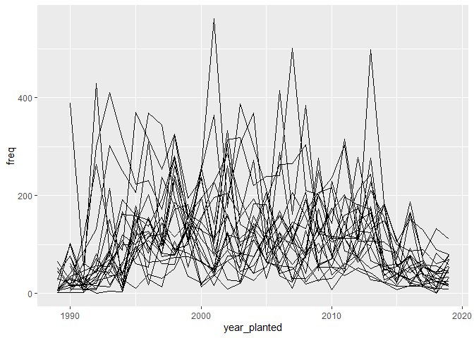<!-- -->

A barplot also ended up being too noisy (see below).

``` r
ggplot(year_planted_n_neighbourhood) +
  geom_bar(aes(x=year_planted, y=freq, fill = neighbourhood_name), position= "stack", stat= "identity") +
  theme(legend.position="none")
```

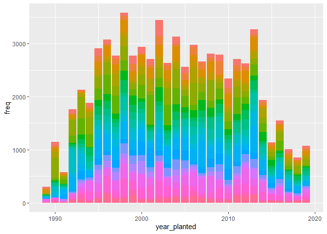<!-- -->

To avoid plot overnoisiness, the number of trees planted per
neighbourhood was inspected per year. We thus looked at the first year
plantations were recorded, and every decade afterwards, including the
last year for which we have data. After inspection, this was deemed more
informative than grouping by decades.

Here is the plot for **1989**:

``` r
year1989_planted_n_neighbourhood <- year_planted_n_neighbourhood %>%
  filter(year_planted=="1989")

ggplot(year1989_planted_n_neighbourhood) +
  geom_bar(
  aes(y=neighbourhood_name, x=freq, fill = neighbourhood_name),
  stat= "identity") +
  theme_bw() +
  theme(legend.position="none") +
  geom_vline(xintercept=mean(year1989_planted_n_neighbourhood$freq)) +
  ylab("Name of the neighbourhood") +
  xlab("Number of trees planted in 1989") 
```

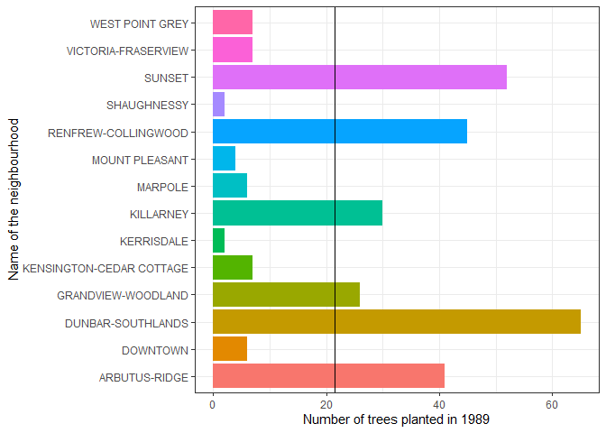<!-- -->

Here is the plot for **1999**:

``` r
year1999_planted_n_neighbourhood <- year_planted_n_neighbourhood %>%
  filter(year_planted=="1999")

ggplot(year1999_planted_n_neighbourhood) +
  geom_bar(
  aes(y=neighbourhood_name, x=freq, fill = neighbourhood_name),
  stat= "identity") +
  theme_bw() +
  theme(legend.position="none") +
  geom_vline(xintercept=mean(year1999_planted_n_neighbourhood$freq)) +
  ylab("Name of the neighbourhood") +
  xlab("Number of trees planted in 1999") 
```

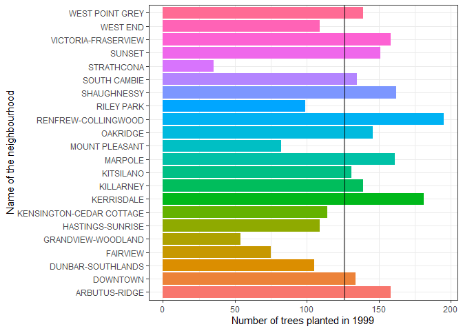<!-- -->

Here is the plot for **2009**:

``` r
year2009_planted_n_neighbourhood <- year_planted_n_neighbourhood %>%
  filter(year_planted=="2009")

ggplot(year2009_planted_n_neighbourhood) +
  geom_bar(
  aes(y=neighbourhood_name, x=freq, fill = neighbourhood_name),
  stat= "identity") +
  theme_bw() +
  theme(legend.position="none") +
  geom_vline(xintercept=mean(year2009_planted_n_neighbourhood$freq)) +
  ylab("Name of the neighbourhood") +
  xlab("Number of trees planted in 2009") 
```

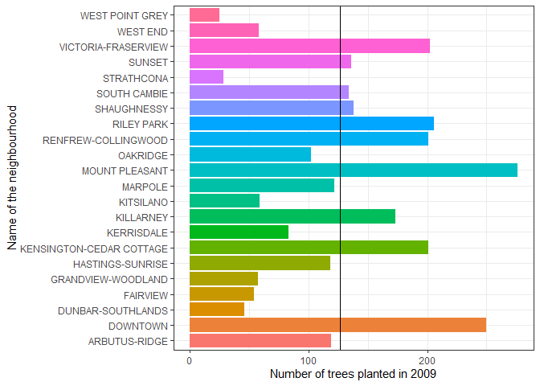<!-- -->

Here is the plot for **2019**:

``` r
year2019_planted_n_neighbourhood <- year_planted_n_neighbourhood %>%
  filter(year_planted=="2019")

plot2019 <- ggplot(year2019_planted_n_neighbourhood) +
  geom_bar(
  aes(y=neighbourhood_name, x=freq, fill = neighbourhood_name),
  stat= "identity") +
  theme_bw() +
  theme(legend.position="none") +
  geom_vline(xintercept=mean(year2019_planted_n_neighbourhood$freq)) +
  ylab("Name of the neighbourhood") +
  xlab("Number of trees planted in 2019") 
plot2019
```

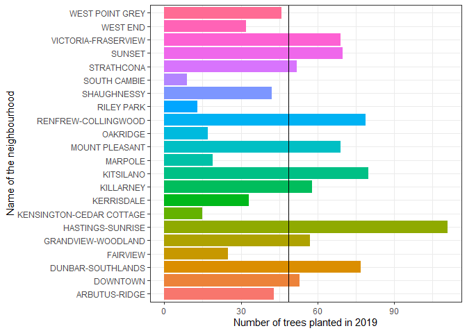<!-- -->

These plots do indeed have at least two geom layers, as demonstrated
below with the 2019 plot.

``` r
# gets layers in plot
layers_plot2019 <- sapply(plot2019$layers, function(x) class(x$geom)[1])
# print number of layers
cat('This plot has:', length(layers_plot2019), 'layers\n')
```

    ## This plot has: 2 layers

``` r
# print layer names
cat('The layers are:', layers_plot2019)
```

    ## The layers are: GeomBar GeomVline

Through these plots, we can observe how there was an increase in the
number of neighbourhoods where trees were planted after the first year
that plantation started being recorded. We can also see how plantation
has increased throughout the years, overall and also in specific
neighbourhoods, as some seem to get more planted trees than others.

This thus greatly help answering the question: *“How has the quantity of
trees planted each year changed in specific areas?”*

#### 1.2.2: Question 2

**1.2.2.1 Question:** *Has the planting technique (presence of a root
barrier and tree grate) evolved?*

**1.2.2.2 Summarization:** Task 3 was selected: *Create a categorical
variable with 3 or more groups from an existing numerical variable. You
can use this new variable in the other tasks! An example: age in years
into “child, teen, adult, senior”.*

To gain an overview of the planting technique evolution, we want to
create a new categorical data from `date_planted` that separates the
trees by the decade they were planted in.

For this research question, the two main variables that will be used are
`root_barrier`, `plant_area`, and `date_planted`. In the first milestone
we established there were no NA values for `root_barrier`, but there
were some in `date_planted` and `plant_area` that need to be dropped.

``` r
trees_noNA_date_area <- vancouver_trees %>% drop_na(date_planted) %>% # Removal of all NA date_planted rows
drop_na(plant_area)
sum(is.na(trees_noNA_date_area$date_planted)) # All data with NA values for data_planted have been successfully dropped
```

    ## [1] 0

``` r
sum(is.na(trees_noNA_date_area$plant_area))
```

    ## [1] 0

``` r
trees_noNA_date_area
```

    ## # A tibble: 69,171 × 20
    ##    tree_id civic_number std_street    genus_name species_name cultivar_name  
    ##      <dbl>        <dbl> <chr>         <chr>      <chr>        <chr>          
    ##  1  149556          494 W 58TH AV     ULMUS      AMERICANA    BRANDON        
    ##  2  149563          450 W 58TH AV     ZELKOVA    SERRATA      <NA>           
    ##  3  149579         4994 WINDSOR ST    STYRAX     JAPONICA     <NA>           
    ##  4  149590          858 E 39TH AV     FRAXINUS   AMERICANA    AUTUMN APPLAUSE
    ##  5  149604         5032 WINDSOR ST    ACER       CAMPESTRE    <NA>           
    ##  6  149617         4909 SHERBROOKE ST ACER       PLATANOIDES  COLUMNARE      
    ##  7  149618         4925 SHERBROOKE ST ACER       PLATANOIDES  COLUMNARE      
    ##  8  149619         4969 SHERBROOKE ST ACER       PLATANOIDES  COLUMNARE      
    ##  9  149625          720 E 39TH AV     FRAXINUS   AMERICANA    AUTUMN APPLAUSE
    ## 10  149626          736 E 39TH AV     TILIA      EUCHLORA   X <NA>           
    ## # ℹ 69,161 more rows
    ## # ℹ 14 more variables: common_name <chr>, assigned <chr>, root_barrier <chr>,
    ## #   plant_area <chr>, on_street_block <dbl>, on_street <chr>,
    ## #   neighbourhood_name <chr>, street_side_name <chr>, height_range_id <dbl>,
    ## #   diameter <dbl>, curb <chr>, date_planted <date>, longitude <dbl>,
    ## #   latitude <dbl>

Now that the NA values have been dropped, we want to change the
`date_planted` variable so that it contains only the year the tree was
planted, and no longer the month and day.

``` r
trees_noNA_date_area$year_planted<-as.numeric(format(trees_noNA_date_area$date_planted, "%Y"))
glimpse(trees_noNA_date_area$year_planted)
```

    ##  num [1:69171] 1999 1996 1993 1996 1993 ...

Now that this is done, it should be easier to create our categorical
variable containing the decade of plantation.

``` r
trees_noNA_decade_area <- trees_noNA_date_area %>%
  mutate(decade_planted=case_when(
    year_planted <= 1999 ~ "First_decade",
    year_planted <= 2009 ~ "Second_decade",
    year_planted <= 2019 ~ "Third_decade",
  ))
trees_noNA_decade_area_show <-trees_noNA_decade_area%>%
   select(decade_planted, year_planted, date_planted)
head(trees_noNA_decade_area_show)
```

    ## # A tibble: 6 × 3
    ##   decade_planted year_planted date_planted
    ##   <chr>                 <dbl> <date>      
    ## 1 First_decade           1999 1999-01-13  
    ## 2 First_decade           1996 1996-05-31  
    ## 3 First_decade           1993 1993-11-22  
    ## 4 First_decade           1996 1996-04-29  
    ## 5 First_decade           1993 1993-12-17  
    ## 6 First_decade           1993 1993-12-16

This would permit us to differentiate between decades for the evolution
of planting technique.

**1.2.2.3 Graphing:** Task 7 was selected: *Make a graph where it makes
sense to customize the alpha transparency.*

To be able to visualize the evolution of the planting technique, we must
first manipulate the `plant_area` variable to show only whether or not a
tree grate has been installed.

``` r
trees_noNA_date_area <- trees_noNA_date_area %>%
  mutate(tree_grate= case_when(
    plant_area %in% c("g", "G") ~ "Y", 
    TRUE ~ "N"
  ))
glimpse(trees_noNA_date_area$tree_grate)
```

    ##  chr [1:69171] "N" "N" "N" "N" "N" "N" "N" "N" "N" "N" "N" "N" "N" "N" "N" ...

Now we make a new dataframe that is in the long format where we only
have instances of “Y” for `root_barrier` or `tree_grate`, with the year
for each instances.

``` r
trees_date_grate_barrier<-trees_noNA_date_area %>%
  select(year_planted, root_barrier, tree_grate)

# melt data for plotting
trees_date_grate_barrier <- trees_date_grate_barrier %>%
  pivot_longer(cols = c("root_barrier", "tree_grate"),
               names_to = "type",
               values_to = "value") %>%
  filter(value== "Y") 
trees_date_grate_barrier
```

    ## # A tibble: 9,614 × 3
    ##    year_planted type         value
    ##           <dbl> <chr>        <chr>
    ##  1         2016 root_barrier Y    
    ##  2         2007 root_barrier Y    
    ##  3         2005 root_barrier Y    
    ##  4         2004 root_barrier Y    
    ##  5         2005 root_barrier Y    
    ##  6         2007 root_barrier Y    
    ##  7         2006 root_barrier Y    
    ##  8         2007 root_barrier Y    
    ##  9         1995 tree_grate   Y    
    ## 10         1995 tree_grate   Y    
    ## # ℹ 9,604 more rows

We can now plot our graph.

``` r
ggplot(data = trees_date_grate_barrier, aes(x= year_planted, color = type, fill = type)) +
geom_density(alpha = 0.5) +
theme_bw()+
xlab("Years") +
ylab("Density") 
```

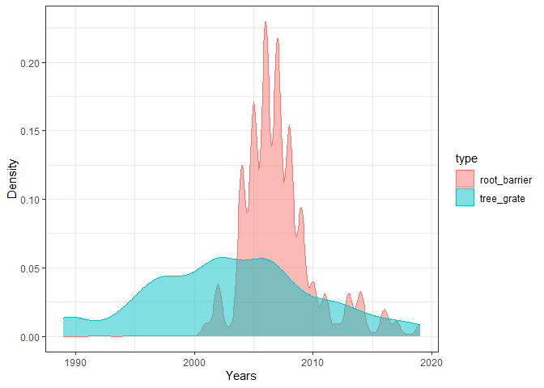<!-- -->

Through this graph, we can observe the evolution through the years of
the presence of both root barriers and tree grates. We can see when
either first started making an apparence, and how they progressed since
that first apparence. We can for example see that while tree grates were
present since the very first year plantation record keeping started,
root barrier installation was a later initiative that mostly happened
before 2010.

This thus greatly help answering the question: *Has the planting
technique (presence of a root barrier and tree grate) evolved?*

#### 1.2.3: Question 3

**1.2.3.1 Question:** *Do localisations differ in the variety of types
of trees planted there?*

**1.2.3.2 Summarization:** Task 4 was selected: *Compute the proportion
and counts in each category of one categorical variable across the
groups of another categorical variable from your data. Do not use the
function `table()`!*

Completing this task will help us see the relationship between the two
categorical variables.

For the summarization for this research question, we will look at the
number and proportion of species of trees per neighbourhood. Here, the
two main variables that will be used are `neighbourhood_name` and
`common_name`. In the first milestone we established there were no NA
values for both of these variables.

We can thus immediately create a new dataframe with a new variable that
depicts the number of trees planted per year per neighbourhoods.

``` r
species_neighbourhood<-vancouver_trees %>%
  group_by(neighbourhood_name, common_name) %>%
  summarise(.groups="keep", n=n()) %>%
  ungroup() %>%
  group_by(neighbourhood_name) %>%
  mutate(frequency=n/sum(n))
species_neighbourhood
```

    ## # A tibble: 6,141 × 4
    ## # Groups:   neighbourhood_name [22]
    ##    neighbourhood_name common_name                  n frequency
    ##    <chr>              <chr>                    <int>     <dbl>
    ##  1 ARBUTUS-RIDGE      ACCOLADE CHERRY              1  0.000193
    ##  2 ARBUTUS-RIDGE      AKEBONO FLOWERING CHERRY    61  0.0118  
    ##  3 ARBUTUS-RIDGE      ALDERLEAFED MOUNTAIN ASH     8  0.00155 
    ##  4 ARBUTUS-RIDGE      ALIA'S MAGNOLIA              3  0.000580
    ##  5 ARBUTUS-RIDGE      AMERICAN ELM                92  0.0178  
    ##  6 ARBUTUS-RIDGE      AMERICAN FILBERT             4  0.000774
    ##  7 ARBUTUS-RIDGE      AMERICAN HORNBEAM           14  0.00271 
    ##  8 ARBUTUS-RIDGE      AMERICAN MOUNTAIN ASH        8  0.00155 
    ##  9 ARBUTUS-RIDGE      AMERICAN SWEETGUM            2  0.000387
    ## 10 ARBUTUS-RIDGE      AMUR MAPLE                   5  0.000967
    ## # ℹ 6,131 more rows

This informs us that there is indeed a great variability between species
in the number of trees that get planted. Moreover, we can observe that
the frequency of the species being planted varies between
neighbourhoods. This indicates that our research question is an
interesting one, worth exploring.

Indeed, some species seem to get barely planted at all, whereas other
species get planted far more, for example red maples in Downtown.

**1.2.3.3 Graphing:** Task 8 was selected: *Create a graph that has at
least two geom layers.*

The graph most likely to help answer our question was deemed to be by
comparing the number of species of trees planted between neighbourhoods.
To do so, a new dataframe had to be created.

``` r
n_species_neighbourhood <- species_neighbourhood %>%
  group_by(neighbourhood_name) %>%
  summarise(num_species=n_distinct(common_name))
n_species_neighbourhood
```

    ## # A tibble: 22 × 2
    ##    neighbourhood_name       num_species
    ##    <chr>                          <int>
    ##  1 ARBUTUS-RIDGE                    260
    ##  2 DOWNTOWN                         168
    ##  3 DUNBAR-SOUTHLANDS                364
    ##  4 FAIRVIEW                         223
    ##  5 GRANDVIEW-WOODLAND               310
    ##  6 HASTINGS-SUNRISE                 347
    ##  7 KENSINGTON-CEDAR COTTAGE         323
    ##  8 KERRISDALE                       284
    ##  9 KILLARNEY                        237
    ## 10 KITSILANO                        336
    ## # ℹ 12 more rows

Once this was done, we could plot a graph showing the number of species
planted per neighbourhoods.

``` r
plot_species_neighbourhood <- ggplot(n_species_neighbourhood) +
  geom_bar(
  aes(y=neighbourhood_name, x=num_species, fill = neighbourhood_name),
  stat= "identity") +
  theme_bw() +
  theme(legend.position="none") +
  geom_vline(xintercept=mean(n_species_neighbourhood$num_species)) +
  ylab("Name of the neighbourhood") +
  xlab("Number of species of trees planted") 
plot_species_neighbourhood
```

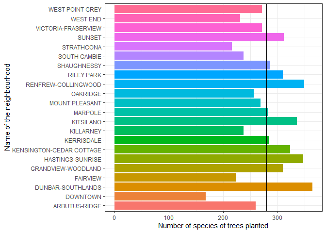<!-- -->

This plot does indeed have at least two geom layers, as demonstrated
below:

``` r
# gets layers in plot
layers_plot_species_neighbourhood <- sapply(plot_species_neighbourhood$layers, function(x) class(x$geom)[1])
# print number of layers
cat('This plot has:', length(layers_plot_species_neighbourhood), 'layers\n')
```

    ## This plot has: 2 layers

``` r
# print layer names
cat('The layers are:', layers_plot_species_neighbourhood)
```

    ## The layers are: GeomBar GeomVline

Through this plot, we can observe how there is a great variation in the
number of species of trees that were planted depending on the
neighbourhood, with some neighbourhoods having a far greater variety of
species of trees being planted in them then other neighbourhoods.

This thus greatly help answering the question: *Do localisations differ
in the variety of types of trees planted there?*

#### 1.2.4: Question 4

**1.2.4.1 Question:** *Have different types of trees been favored
through time?*

**1.2.4.2 Summarization:** Task 1 was selected: *Compute the range,
mean, and two other summary statistics of one numerical variable across
the groups of one categorical variable from your data.*

Obtaining summary statistics helps us get information and an overview
concerning this research question.

For this research question, the two main variables that will be used are
`common_name` and `date_planted`. In the first milestone we established
there were no NA values for `common_name`, but there were some in
`date_planted`.

Thankfully, we can use and adapt the work done for the first research
question to this question. We can thus use the already extant
`vancouver_trees_noNA_date` to create a new dataframe with a new
variable that depicts the number of trees planted per year per species.

``` r
year_planted_n_species<-vancouver_trees_noNA_date %>%
  group_by(common_name, year_planted) %>%
  summarise(.groups="keep", n=n())
year_planted_n_species
```

    ## # A tibble: 3,115 × 3
    ## # Groups:   common_name, year_planted [3,115]
    ##    common_name              year_planted     n
    ##    <chr>                           <dbl> <int>
    ##  1 ACCOLADE CHERRY                  1998     1
    ##  2 ACCOLADE CHERRY                  1999     2
    ##  3 AKEBONO FLOWERING CHERRY         1989     6
    ##  4 AKEBONO FLOWERING CHERRY         1993    40
    ##  5 AKEBONO FLOWERING CHERRY         1995    37
    ##  6 AKEBONO FLOWERING CHERRY         1996   197
    ##  7 AKEBONO FLOWERING CHERRY         1997    26
    ##  8 AKEBONO FLOWERING CHERRY         1998   103
    ##  9 AKEBONO FLOWERING CHERRY         1999    82
    ## 10 AKEBONO FLOWERING CHERRY         2000    83
    ## # ℹ 3,105 more rows

We can now proceed with looking into the range (and the minimum and
maximum), the mean, the median, and the standard deviation of the number
of trees planted per year across the various species.

``` r
year_species_stats <- year_planted_n_species %>%
  group_by(common_name) %>%
  summarise(
  min = min(n),
  max = max(n),
  range = max-min,
  mean = mean(n),
  median = median(n),
  stdev = sd(n))
print(year_species_stats)
```

    ## # A tibble: 468 × 7
    ##    common_name                 min   max range  mean median  stdev
    ##    <chr>                     <int> <int> <int> <dbl>  <dbl>  <dbl>
    ##  1 ACCOLADE CHERRY               1     2     1  1.5     1.5  0.707
    ##  2 AKEBONO FLOWERING CHERRY      6   197   191 73.6    65   50.2  
    ##  3 ALDERLEAFED MOUNTAIN ASH      1    59    58 27.5    26.5 25.2  
    ##  4 ALIA'S MAGNOLIA               3     3     0  3       3   NA    
    ##  5 ALLEGHENY SERVICEBERRY        2     4     2  3       3    1.41 
    ##  6 ALLGOLD EUROPEAN ASH          1    69    68 25.7     7   37.6  
    ##  7 ALMIRA NORWAY MAPLE           1     1     0  1       1    0    
    ##  8 AMANOGAWA JAPANESE CHERRY     1     3     2  1.67    1    1.15 
    ##  9 AMERICAN BEECH                4    17    13  9       6    7    
    ## 10 AMERICAN CHESTNUT             1     1     0  1       1   NA    
    ## # ℹ 458 more rows

This informs us that there is indeed a great variability in the number
of trees planted per year depending on the species of the tree. This
indicates that our research question is an interesting one, worth
exploring.

Indeed, the number of trees planted per year can be magnitudes either
for one species of tree compared to another. Night purple leaf plums,
for example, were planted a hundred times more on average than the
sweetgum species. We can also identify the species that were only
planted one year (range=0).

**1.2.4.3 Graphing:** Task 9 was selected: *Create 3 histograms, with
each histogram having different sized bins. Pick the “best” one and
explain why it is the best.*

Looking at whether different types of trees have been favoured through
time, we want to look at how specific species plantation has evolved
throughout the years. However, there are 634 species in
`vancouver_trees`. While we could try to plot a graph similar to these
ones used for the previous research questions, there are too many
variables and it will make the graph illegible.

One way to observe the evolution of species plantation over time is to
look at specific species. This, while not a global view, will still
inform us, and hint at more global change. To do so, we chose a specific
species, red maples, and plotted a histogram. Bins are important for
histograms.

``` r
ggplot(year_planted_n_species, aes(x = year_planted, y = after_stat(density)))+
  geom_histogram(binwidth = 0.1) +
  theme_bw() +
  xlab("Year of Plantation")
```

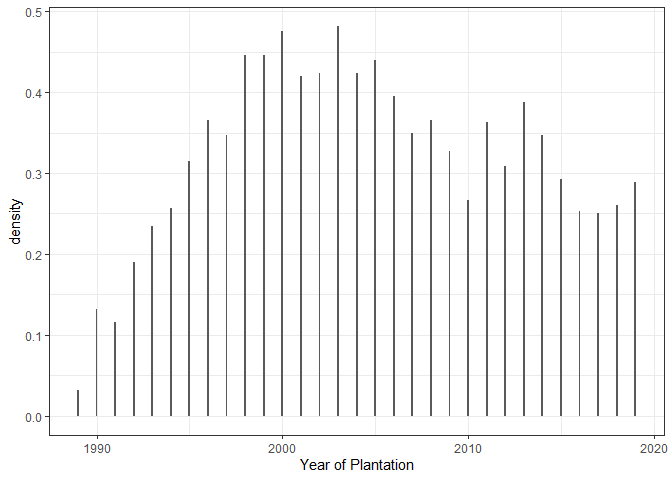<!-- -->

``` r
ggplot(year_planted_n_species, aes(x = year_planted, y = after_stat(density)))+
  geom_histogram(binwidth = 1) +
  theme_bw() +
  xlab("Year of Plantation")
```

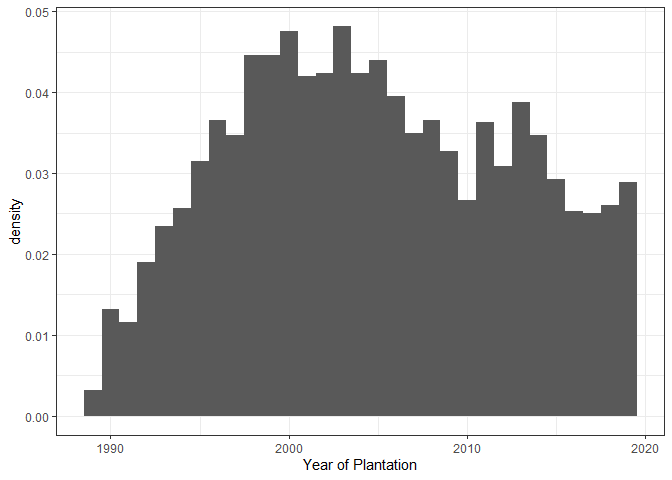<!-- -->

``` r
ggplot(year_planted_n_species, aes(x = year_planted, y = after_stat(density)))+
  geom_histogram(binwidth = 10)+
  theme_bw() +
  xlab("Year of Plantation")
```

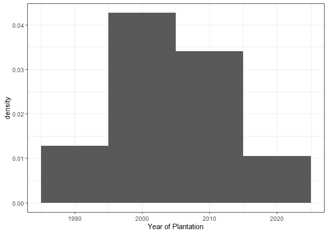<!-- -->

Out of these, the `binwidth = 0.1` is easy to discard, as when the
binwidth is too small, it makes it difficult to create groups of data.
For `binwidth = 10`, this one is also easy to discard, as when the
binwidth is too big, you lose precision and the ability to
differentiate. Here we loose sight of a potential second peak compared
to `binwidth = 1`, which we thus decided to select.

Through these plots, we can observe how the plantation of one specific
species of trees has greatly varied throughout the years.

This doesn’t fully answer our question but it indicates change over
time. The necessary plots to answer our research question are beyond the
scope of this class, as this is the best we can do for now while
respecting task instructions.

This plot hints at potential answers to the question: *Have different
types of trees been favored through time?*

<!----------------------------------------------------------------------------->

### 1.3 Research Questions Progress (2 points)

Based on the operations that you’ve completed, how much closer are you
to answering your research questions? Think about what aspects of your
research questions remain unclear. Can your research questions be
refined, now that you’ve investigated your data a bit more? Which
research questions are yielding interesting results?

<!------------------------- Write your answer here ---------------------------->

The progress has been partially looked into in 1.2. However, following
is the progress for each research question:

#### 1.3.1: Question 1

Concerning the first research question: *How has the quantity of trees
planted each year changed in specific areas?*

Through the graphs created, we can observe an increase after the first
year of the dataframe in the number of neighbourhoods where trees were
being planted. We can also see how plantation has increased throughout
the years overall and at the same time in specific neighbourhoods, as
some seem to get more planted trees than others.

We can thus observe the evolution of the quantity of trees planted per
year.

These plots inform us of all the differences that could interest us and
that concern our research question. If we duplicated the graphs with one
for each year, the question could be considered sufficiently answered.
But while they inform us, they do not give us any quantitative
measurement of these differences. To truly respond to our first research
question, it would be interesting to produce a statistical measure.

#### 1.3.2: Question 2

Concerning the second research question: *Has the planting technique
(presence of a root barrier and tree grate) evolved?*

Through the created graph, we can observe the evolution through the
years of the presence of both root barriers and tree grates. We can see
when either first started making an apparence, and how they progressed
since that first apparence. We can for example see that while tree
grates were present since the very first year plantation record keeping
started, root barrier installation was a later initiative that mostly
happened before 2010.

We can thus observe the evolution of the planting technique throughout
the years.

The graph informs us of all the differences that could interest us and
that concern our research question. The question could thus be
considered sufficiently answered. But while it informs us, the graph
does not provide us any quantitative measurement of these differences.
To truly respond to our second research question, it would be
interesting to produce a statistical measure.

#### 1.3.3: Question 3

Concerning the third research question: *Do localisations differ in the
variety of types of trees planted there?*

Through the created graph, we can observe how there is a great variation
in the number of species of trees that were planted depending on the
neighbourhood, with some neighbourhoods having a far greater variety of
species of trees being planted in them then other neighbourhoods.

We thus can observe the variety of type of trees planted per
neighbourhoods.

The graph once again informs us of all the differences that could
interest us and that concern our research question. The question could
thus be considered sufficiently answered. But while it informs us, the
graph does not provide us any quantitative measurement of these
differences. To truly respond to our third research question, it would
be interesting to produce a statistical measure.

#### 1.3.4: Question 4

Concerning the fourth research question: *Have different types of trees
been favored through time?*

Through the created graphs, we can observe how the plantation of one
specific species of trees has greatly varied throughout the years.

This doesn’t fully answer our question but it indicates change over
time. The necessary plots to answer our research question are beyond the
scope of this class, as this is the best we can do for now while
respecting task instructions.

We could look at how each species of trees evolves through time, but we
would still need to produce a global statistical measure to to truly
respond to our question as it is formulated now. A version of this
question that would be easier to answer is: *Has the number of species
of trees planted changed through the years?*

<!----------------------------------------------------------------------------->

# Task 2: Tidy your data

In this task, we will do several exercises to reshape our data. The goal
here is to understand how to do this reshaping with the `tidyr` package.

A reminder of the definition of *tidy* data:

- Each row is an **observation**
- Each column is a **variable**
- Each cell is a **value**

### 2.1 Tidy or untidy? (2 points)

Based on the definition above, can you identify if your data is tidy or
untidy? Go through all your columns, or if you have \>8 variables, just
pick 8, and explain whether the data is untidy or tidy.

<!--------------------------- Start your work below --------------------------->

While we do have more than 8 variables, it is as quick to look into the
whole dataset than to look into a subset.

First, we have to check whether there are row duplicates, or if they are
all unique:

``` r
dim(vancouver_trees[duplicated(vancouver_trees$tree_id),])[1]
```

    ## [1] 0

All rows are unique, there is thus no duplicate observations. Now, let’s
look into the columns.

``` r
colnames(vancouver_trees)
```

    ##  [1] "tree_id"            "civic_number"       "std_street"        
    ##  [4] "genus_name"         "species_name"       "cultivar_name"     
    ##  [7] "common_name"        "assigned"           "root_barrier"      
    ## [10] "plant_area"         "on_street_block"    "on_street"         
    ## [13] "neighbourhood_name" "street_side_name"   "height_range_id"   
    ## [16] "diameter"           "curb"               "date_planted"      
    ## [19] "longitude"          "latitude"

All columns are variables, there are no variable duplicates. By using
`?vancouver_trees` we can see that each variable is different. Now,
let’s look into the cells.

``` r
sum(is.null(vancouver_trees))
```

    ## [1] 0

Each cell has a value.

As each tree, each observation, is represented by a single row (no
duplicates), and each variable are isolated into separate columns and
are different, and each cell has a value, by the definition above I
believe `vancouver_trees` can be considered tidy.

<!----------------------------------------------------------------------------->

### 2.2 Untidy, then tidy again (4 points)

Now, if your data is tidy, untidy it! Then, tidy it back to it’s
original state.

If your data is untidy, then tidy it! Then, untidy it back to it’s
original state.

Be sure to explain your reasoning for this task. Show us the “before”
and “after”.

<!--------------------------- Start your work below --------------------------->

First, let’s take a look at `vancouver_trees`

As `vancouver_trees` is tidy, it can be made untidy using
`pivot_longer()` to make new variables. Here we create two new
variables, `name_type` and `name`. `name_type` will be either
`genus_name`, `species_name`, `cultivar_name`, or `common_name`. This
will untidy the data as there will be now 4 rows per tree.

``` r
untidy_trees <- vancouver_trees %>% 
   pivot_longer(cols = c("genus_name", "species_name", "cultivar_name", "common_name"),
                names_to = c("name_type"), 
                values_to = "name") 
select(untidy_trees, name_type, name, everything())
```

    ## # A tibble: 586,444 × 18
    ##    name_type     name      tree_id civic_number std_street assigned root_barrier
    ##    <chr>         <chr>       <dbl>        <dbl> <chr>      <chr>    <chr>       
    ##  1 genus_name    ULMUS      149556          494 W 58TH AV  N        N           
    ##  2 species_name  AMERICANA  149556          494 W 58TH AV  N        N           
    ##  3 cultivar_name BRANDON    149556          494 W 58TH AV  N        N           
    ##  4 common_name   BRANDON …  149556          494 W 58TH AV  N        N           
    ##  5 genus_name    ZELKOVA    149563          450 W 58TH AV  N        N           
    ##  6 species_name  SERRATA    149563          450 W 58TH AV  N        N           
    ##  7 cultivar_name <NA>       149563          450 W 58TH AV  N        N           
    ##  8 common_name   JAPANESE…  149563          450 W 58TH AV  N        N           
    ##  9 genus_name    STYRAX     149579         4994 WINDSOR ST N        N           
    ## 10 species_name  JAPONICA   149579         4994 WINDSOR ST N        N           
    ## # ℹ 586,434 more rows
    ## # ℹ 11 more variables: plant_area <chr>, on_street_block <dbl>,
    ## #   on_street <chr>, neighbourhood_name <chr>, street_side_name <chr>,
    ## #   height_range_id <dbl>, diameter <dbl>, curb <chr>, date_planted <date>,
    ## #   longitude <dbl>, latitude <dbl>

We can tidy the data back using `pivot_wider`.

``` r
untidy_trees%>%
  pivot_wider(names_from = name_type, values_from = name) %>% 
  select(genus_name, species_name, cultivar_name, common_name, everything())
```

    ## # A tibble: 146,611 × 20
    ##    genus_name species_name cultivar_name   common_name      tree_id civic_number
    ##    <chr>      <chr>        <chr>           <chr>              <dbl>        <dbl>
    ##  1 ULMUS      AMERICANA    BRANDON         BRANDON ELM       149556          494
    ##  2 ZELKOVA    SERRATA      <NA>            JAPANESE ZELKOVA  149563          450
    ##  3 STYRAX     JAPONICA     <NA>            JAPANESE SNOWBE…  149579         4994
    ##  4 FRAXINUS   AMERICANA    AUTUMN APPLAUSE AUTUMN APPLAUSE…  149590          858
    ##  5 ACER       CAMPESTRE    <NA>            HEDGE MAPLE       149604         5032
    ##  6 PYRUS      CALLERYANA   CHANTICLEER     CHANTICLEER PEAR  149616          585
    ##  7 ACER       PLATANOIDES  COLUMNARE       COLUMNAR NORWAY…  149617         4909
    ##  8 ACER       PLATANOIDES  COLUMNARE       COLUMNAR NORWAY…  149618         4925
    ##  9 ACER       PLATANOIDES  COLUMNARE       COLUMNAR NORWAY…  149619         4969
    ## 10 FRAXINUS   AMERICANA    AUTUMN APPLAUSE AUTUMN APPLAUSE…  149625          720
    ## # ℹ 146,601 more rows
    ## # ℹ 14 more variables: std_street <chr>, assigned <chr>, root_barrier <chr>,
    ## #   plant_area <chr>, on_street_block <dbl>, on_street <chr>,
    ## #   neighbourhood_name <chr>, street_side_name <chr>, height_range_id <dbl>,
    ## #   diameter <dbl>, curb <chr>, date_planted <date>, longitude <dbl>,
    ## #   latitude <dbl>

We have thus tidy’d and untidy’d our data.

<!----------------------------------------------------------------------------->

### 2.3 Research Questions Selection (4 points)

Now, you should be more familiar with your data, and also have made
progress in answering your research questions. Based on your interest,
and your analyses, pick 2 of the 4 research questions to continue your
analysis in the remaining tasks:

<!-------------------------- Start your work below ---------------------------->

1.  Do localisations differ in the variety of types of trees planted
    there?
2.  Has the planting technique (presence of a root barrier and tree
    grate) evolved?

<!----------------------------------------------------------------------------->

Explain your decision for choosing the above two research questions.

<!--------------------------- Start your work below --------------------------->

These two research questions have been selected because, through the
first task, in which the data was processed and summarized, all the
information necessary to answer these research questions has been
brought into focus. This is true with these questions more than with the
other two.

Now that all the information concerning our questions is visible, it
would be very interesting to generate statistical measure to determine
whether the changes observed in the graphs are significant or not.

<!----------------------------------------------------------------------------->

Now, try to choose a version of your data that you think will be
appropriate to answer these 2 questions. Use between 4 and 8 functions
that we’ve covered so far (i.e. by filtering, cleaning, tidy’ing,
dropping irrelevant columns, etc.).

(If it makes more sense, then you can make/pick two versions of your
data, one for each research question.)

<!--------------------------- Start your work below --------------------------->

#### 2.3.1: Question 1: *Do localisations differ in the variety of types of trees planted there?*

As we are only concerned with `neighbourhood_name` (to represent
localisation) and `common_name` (to represent the types of trees) for
this question, we can first filter out unnecessary variables.

``` r
q1_data1<-vancouver_trees %>%
  select(neighbourhood_name, common_name)
q1_data1
```

    ## # A tibble: 146,611 × 2
    ##    neighbourhood_name       common_name          
    ##    <chr>                    <chr>                
    ##  1 MARPOLE                  BRANDON ELM          
    ##  2 MARPOLE                  JAPANESE ZELKOVA     
    ##  3 KENSINGTON-CEDAR COTTAGE JAPANESE SNOWBELL    
    ##  4 KENSINGTON-CEDAR COTTAGE AUTUMN APPLAUSE ASH  
    ##  5 KENSINGTON-CEDAR COTTAGE HEDGE MAPLE          
    ##  6 MARPOLE                  CHANTICLEER PEAR     
    ##  7 KENSINGTON-CEDAR COTTAGE COLUMNAR NORWAY MAPLE
    ##  8 KENSINGTON-CEDAR COTTAGE COLUMNAR NORWAY MAPLE
    ##  9 KENSINGTON-CEDAR COTTAGE COLUMNAR NORWAY MAPLE
    ## 10 KENSINGTON-CEDAR COTTAGE AUTUMN APPLAUSE ASH  
    ## # ℹ 146,601 more rows

We want to create a new variable that contains the number of species of
trees planted per neighbourhoods.

``` r
q1_data <- q1_data1 %>%
  group_by(neighbourhood_name) %>%
  summarise(num_species=n_distinct(common_name))
q1_data
```

    ## # A tibble: 22 × 2
    ##    neighbourhood_name       num_species
    ##    <chr>                          <int>
    ##  1 ARBUTUS-RIDGE                    260
    ##  2 DOWNTOWN                         168
    ##  3 DUNBAR-SOUTHLANDS                364
    ##  4 FAIRVIEW                         223
    ##  5 GRANDVIEW-WOODLAND               310
    ##  6 HASTINGS-SUNRISE                 347
    ##  7 KENSINGTON-CEDAR COTTAGE         323
    ##  8 KERRISDALE                       284
    ##  9 KILLARNEY                        237
    ## 10 KITSILANO                        336
    ## # ℹ 12 more rows

#### 2.3.2: Question 2: *Has the planting technique (presence of a root barrier and tree grate) evolved?*

As we are only concerned with `plant_area` (for the potential presence
of a tree grate), `root_barrier` (for the potential presence of a root
barrier), and `date_planted`, we can first filter out unnecessary
variables.

``` r
q2_data1<-vancouver_trees %>%
  select(date_planted, root_barrier, plant_area)
q2_data1
```

    ## # A tibble: 146,611 × 3
    ##    date_planted root_barrier plant_area
    ##    <date>       <chr>        <chr>     
    ##  1 1999-01-13   N            N         
    ##  2 1996-05-31   N            N         
    ##  3 1993-11-22   N            4         
    ##  4 1996-04-29   N            4         
    ##  5 1993-12-17   N            4         
    ##  6 NA           N            B         
    ##  7 1993-12-16   N            6         
    ##  8 1993-12-16   N            6         
    ##  9 1993-12-16   N            3         
    ## 10 1993-12-03   N            3         
    ## # ℹ 146,601 more rows

Now, as we can already see in the first page, there are some NA values.
We first need to identify where these are.

``` r
q2_data2 <- q2_data1%>% summarise(across(everything(), ~ sum(is.na(.))))
q2_data2 <- as.data.frame(t(as.matrix(q2_data2))) 
q2_data2$variable <- rownames(q2_data2)
rownames(q2_data2) <- 1:nrow(q2_data2)
colnames(q2_data2) <- c("na_count", "Variable")
q2_data2
```

    ##   na_count     Variable
    ## 1    76548 date_planted
    ## 2        0 root_barrier
    ## 3     1486   plant_area

Now that the variables containing NA values have been identified, we can
drop the NA values.

``` r
q2_data3 <- q2_data1 %>% drop_na(date_planted) %>%
drop_na(plant_area)
q2_data3
```

    ## # A tibble: 69,171 × 3
    ##    date_planted root_barrier plant_area
    ##    <date>       <chr>        <chr>     
    ##  1 1999-01-13   N            N         
    ##  2 1996-05-31   N            N         
    ##  3 1993-11-22   N            4         
    ##  4 1996-04-29   N            4         
    ##  5 1993-12-17   N            4         
    ##  6 1993-12-16   N            6         
    ##  7 1993-12-16   N            6         
    ##  8 1993-12-16   N            3         
    ##  9 1993-12-03   N            3         
    ## 10 1993-12-03   N            5         
    ## # ℹ 69,161 more rows

We can see there are less rows, let’s verify there are no more NA
values.

``` r
sum(is.na(q2_data3$date_planted)) 
```

    ## [1] 0

``` r
sum(is.na(q2_data3$plant_area))
```

    ## [1] 0

Now we want to make a new variable that contains only the year of
plantation, and no longer the month and day.

``` r
q2_data3$year_planted<-as.numeric(format(q2_data3$date_planted, "%Y"))
q2_data4 <- q2_data3 %>% select(year_planted, root_barrier, plant_area)
q2_data4
```

    ## # A tibble: 69,171 × 3
    ##    year_planted root_barrier plant_area
    ##           <dbl> <chr>        <chr>     
    ##  1         1999 N            N         
    ##  2         1996 N            N         
    ##  3         1993 N            4         
    ##  4         1996 N            4         
    ##  5         1993 N            4         
    ##  6         1993 N            6         
    ##  7         1993 N            6         
    ##  8         1993 N            3         
    ##  9         1993 N            3         
    ## 10         1993 N            5         
    ## # ℹ 69,161 more rows

Now let’s trade our \``plant_area` variable for a variable that will
only point out whether there is a tree grate or not.

``` r
q2_data <- q2_data4 %>%
  mutate(tree_grate= case_when(
    plant_area %in% c("g", "G") ~ "Y", 
    TRUE ~ "N"
  ))
q2_data <- q2_data%>% select(year_planted, root_barrier, tree_grate)
q2_data
```

    ## # A tibble: 69,171 × 3
    ##    year_planted root_barrier tree_grate
    ##           <dbl> <chr>        <chr>     
    ##  1         1999 N            N         
    ##  2         1996 N            N         
    ##  3         1993 N            N         
    ##  4         1996 N            N         
    ##  5         1993 N            N         
    ##  6         1993 N            N         
    ##  7         1993 N            N         
    ##  8         1993 N            N         
    ##  9         1993 N            N         
    ## 10         1993 N            N         
    ## # ℹ 69,161 more rows

# Task 3: Modelling

## 3.0 (no points)

Pick a research question from 1.2, and pick a variable of interest
(we’ll call it “Y”) that’s relevant to the research question. Indicate
these.

<!-------------------------- Start your work below ---------------------------->

**Research Question**: *Has the planting technique (presence of a root
barrier and tree grate) evolved?*

**Variable of interest**: `root_barrier`

`root_barrier` and `tree_grate` are the two variables we are interested
in looking at the variation through time.

<!----------------------------------------------------------------------------->

## 3.1 Hypothesis (3 points)

Fit a model or run a hypothesis test that provides insight on this
variable with respect to the research question. Store the model object
as a variable, and print its output to screen. We’ll omit having to
justify your choice, because we don’t expect you to know about model
specifics in STAT 545.

- **Note**: It’s OK if you don’t know how these models/tests work. Here
  are some examples of things you can do here, but the sky’s the limit.

  - You could fit a model that makes predictions on Y using another
    variable, by using the `lm()` function.
  - You could test whether the mean of Y equals 0 using `t.test()`, or
    maybe the mean across two groups are different using `t.test()`, or
    maybe the mean across multiple groups are different using `anova()`
    (you may have to pivot your data for the latter two).
  - You could use `lm()` to test for significance of regression
    coefficients.

<!-------------------------- Start your work below ---------------------------->

As the the variation through time of both `root_barrier` and
`tree_grate` have already been shown on a graph previously, providing us
with all the information required to answer our research question, now
we only need to generate statistical measures to determine whether the
changes observed in the graph are significant or not.

Thus, the statistical significance between the mean year of plantation
of a tree has been compared on the basis of whether or not a root
barrier was installed.

``` r
root_barrier_Y <- q2_data%>%
  filter(root_barrier == "Y")%>%
  select(year_planted) # New dataframe with only the year_planted of trees with a root barrier
root_barrier_N <- q2_data%>%
  filter(root_barrier == "N")%>%
  select(year_planted) # New dataframe with only the year_planted of trees without a root barrier

t_root_barrier <- t.test(root_barrier_Y, root_barrier_N, alternative = "two.sided", conf.level = 0.95)

print(t_root_barrier)
```

    ## 
    ##  Welch Two Sample t-test
    ## 
    ## data:  root_barrier_Y and root_barrier_N
    ## t = 85.611, df = 29094, p-value < 2.2e-16
    ## alternative hypothesis: true difference in means is not equal to 0
    ## 95 percent confidence interval:
    ##  3.824166 4.003375
    ## sample estimates:
    ## mean of x mean of y 
    ##  2007.190  2003.276

Additionnally, the statistical significance between the mean year of
plantation of a tree has been compared on the basis of whether or not a
tree grate was installed.

``` r
tree_grate_Y <- q2_data%>%
  filter(tree_grate == "Y")%>%
  select(year_planted) # New dataframe with only the year_planted of trees with a tree grate
tree_grate_N <- q2_data%>%
  filter(tree_grate == "N")%>%
  select(year_planted) # New dataframe with only the year_planted of trees without a tree grate

t_tree_grate <- t.test(tree_grate_Y, tree_grate_N, alternative = "two.sided", conf.level = 0.95)

print(t_tree_grate)
```

    ## 
    ##  Welch Two Sample t-test
    ## 
    ## data:  tree_grate_Y and tree_grate_N
    ## t = -1.8439, df = 663.2, p-value = 0.06565
    ## alternative hypothesis: true difference in means is not equal to 0
    ## 95 percent confidence interval:
    ##  -1.04199854  0.03275214
    ## sample estimates:
    ## mean of x mean of y 
    ##  2003.283  2003.788

With these statistical analyses, we can see that the year of plantation
of a tree impacts significantly whether or not a root barrier was
installed, but not whether or not a tree grate was installed (but there
is a trend).

This is supported by the graph created in 1.2.2, as we could see that
the number of root barriers installed seemed to peak at certain periods
of time, whereas tree grate installation seemed more consistent
throughout the years.

<!----------------------------------------------------------------------------->

## 3.2 Production (3 points)

Produce something relevant from your fitted model: either predictions on
Y, or a single value like a regression coefficient or a p-value.

- Be sure to indicate in writing what you chose to produce.
- Your code should either output a tibble (in which case you should
  indicate the column that contains the thing you’re looking for), or
  the thing you’re looking for itself.
- Obtain your results using the `broom` package if possible. If your
  model is not compatible with the broom function you’re needing, then
  you can obtain your results by some other means, but first indicate
  which broom function is not compatible.

<!-------------------------- Start your work below ---------------------------->

Having run two t-tests, the p-values need to be reported to demonstrate
significance. To do so, we shall use `broom::tidy()`. This will create a
tibble in which our p-value is easily found (in the column `p.value`).

Here it is for `root_barrier`

``` r
tidy_root_barrier <- broom::tidy(t_root_barrier)
print(tidy_root_barrier)
```

    ## # A tibble: 1 × 10
    ##   estimate estimate1 estimate2 statistic p.value parameter conf.low conf.high
    ##      <dbl>     <dbl>     <dbl>     <dbl>   <dbl>     <dbl>    <dbl>     <dbl>
    ## 1     3.91     2007.     2003.      85.6       0    29094.     3.82      4.00
    ## # ℹ 2 more variables: method <chr>, alternative <chr>

And for `tree_grate`

``` r
tidy_tree_grate <- broom::tidy(t_tree_grate)
print(tidy_tree_grate)
```

    ## # A tibble: 1 × 10
    ##   estimate estimate1 estimate2 statistic p.value parameter conf.low conf.high
    ##      <dbl>     <dbl>     <dbl>     <dbl>   <dbl>     <dbl>    <dbl>     <dbl>
    ## 1   -0.505     2003.     2004.     -1.84  0.0656      663.    -1.04    0.0328
    ## # ℹ 2 more variables: method <chr>, alternative <chr>

<!----------------------------------------------------------------------------->

# Task 4: Reading and writing data

Get set up for this exercise by making a folder called `output` in the
top level of your project folder / repository. You’ll be saving things
there.

## 4.1 (3 points)

Take a summary table that you made from Task 1, and write it as a csv
file in your `output` folder. Use the `here::here()` function.

- **Robustness criteria**: You should be able to move your Mini Project
  repository / project folder to some other location on your computer,
  or move this very Rmd file to another location within your project
  repository / folder, and your code should still work.
- **Reproducibility criteria**: You should be able to delete the csv
  file, and remake it simply by knitting this Rmd file.

<!-------------------------- Start your work below ---------------------------->

`species_neighbourhood` is a summary table created in task 1 that shows
the `neighbourhood_name`, `common_name`, with the calculated `n` and
`frequency`. The code will be re-run here.

``` r
species_neighbourhood<-vancouver_trees %>%
  group_by(neighbourhood_name, common_name) %>%
  summarise(.groups="keep", n=n()) %>%
  ungroup() %>%
  group_by(neighbourhood_name) %>%
  mutate(frequency=n/sum(n))
species_neighbourhood
```

    ## # A tibble: 6,141 × 4
    ## # Groups:   neighbourhood_name [22]
    ##    neighbourhood_name common_name                  n frequency
    ##    <chr>              <chr>                    <int>     <dbl>
    ##  1 ARBUTUS-RIDGE      ACCOLADE CHERRY              1  0.000193
    ##  2 ARBUTUS-RIDGE      AKEBONO FLOWERING CHERRY    61  0.0118  
    ##  3 ARBUTUS-RIDGE      ALDERLEAFED MOUNTAIN ASH     8  0.00155 
    ##  4 ARBUTUS-RIDGE      ALIA'S MAGNOLIA              3  0.000580
    ##  5 ARBUTUS-RIDGE      AMERICAN ELM                92  0.0178  
    ##  6 ARBUTUS-RIDGE      AMERICAN FILBERT             4  0.000774
    ##  7 ARBUTUS-RIDGE      AMERICAN HORNBEAM           14  0.00271 
    ##  8 ARBUTUS-RIDGE      AMERICAN MOUNTAIN ASH        8  0.00155 
    ##  9 ARBUTUS-RIDGE      AMERICAN SWEETGUM            2  0.000387
    ## 10 ARBUTUS-RIDGE      AMUR MAPLE                   5  0.000967
    ## # ℹ 6,131 more rows

This table will now be turned into a `.csv` file and stored in the
output folder.

``` r
output_directory <- "output"
file_name <- "exported_species_neighbourhood.csv"
write_csv(species_neighbourhood, here::here(output_directory, file_name))
```

To make sure the file has been created properly, we can print the
contents.

``` r
test_summary <- read_csv(here::here("output", "exported_species_neighbourhood.csv"), show_col_types = FALSE)
test_summary
```

    ## # A tibble: 6,141 × 4
    ##    neighbourhood_name common_name                  n frequency
    ##    <chr>              <chr>                    <dbl>     <dbl>
    ##  1 ARBUTUS-RIDGE      ACCOLADE CHERRY              1  0.000193
    ##  2 ARBUTUS-RIDGE      AKEBONO FLOWERING CHERRY    61  0.0118  
    ##  3 ARBUTUS-RIDGE      ALDERLEAFED MOUNTAIN ASH     8  0.00155 
    ##  4 ARBUTUS-RIDGE      ALIA'S MAGNOLIA              3  0.000580
    ##  5 ARBUTUS-RIDGE      AMERICAN ELM                92  0.0178  
    ##  6 ARBUTUS-RIDGE      AMERICAN FILBERT             4  0.000774
    ##  7 ARBUTUS-RIDGE      AMERICAN HORNBEAM           14  0.00271 
    ##  8 ARBUTUS-RIDGE      AMERICAN MOUNTAIN ASH        8  0.00155 
    ##  9 ARBUTUS-RIDGE      AMERICAN SWEETGUM            2  0.000387
    ## 10 ARBUTUS-RIDGE      AMUR MAPLE                   5  0.000967
    ## # ℹ 6,131 more rows

<!----------------------------------------------------------------------------->

## 4.2 (3 points)

Write your model object from Task 3 to an R binary file (an RDS), and
load it again. Be sure to save the binary file in your `output` folder.
Use the functions `saveRDS()` and `readRDS()`.

- The same robustness and reproducibility criteria as in 4.1 apply here.

<!-------------------------- Start your work below ---------------------------->

Here, we decided to use the tibble created in task 3.0 for our t-test on
root barriers.

First the RDS file was created and placed in the output folder.

``` r
saveRDS(tidy_root_barrier, here::here("output", "tidy_root_barrier.RDS"))
```

Then the RDS file was read back into R.

``` r
readRDS(here::here("output", "tidy_root_barrier.RDS"))
```

    ## # A tibble: 1 × 10
    ##   estimate estimate1 estimate2 statistic p.value parameter conf.low conf.high
    ##      <dbl>     <dbl>     <dbl>     <dbl>   <dbl>     <dbl>    <dbl>     <dbl>
    ## 1     3.91     2007.     2003.      85.6       0    29094.     3.82      4.00
    ## # ℹ 2 more variables: method <chr>, alternative <chr>

<!----------------------------------------------------------------------------->

# Overall Reproducibility/Cleanliness/Coherence Checklist

Here are the criteria we’re looking for.

## Coherence (0.5 points)

The document should read sensibly from top to bottom, with no major
continuity errors.

The README file should still satisfy the criteria from the last
milestone, i.e. it has been updated to match the changes to the
repository made in this milestone.

## File and folder structure (1 points)

You should have at least three folders in the top level of your
repository: one for each milestone, and one output folder. If there are
any other folders, these are explained in the main README.

Each milestone document is contained in its respective folder, and
nowhere else.

Every level-1 folder (that is, the ones stored in the top level, like
“Milestone1” and “output”) has a `README` file, explaining in a sentence
or two what is in the folder, in plain language (it’s enough to say
something like “This folder contains the source for Milestone 1”).

## Output (1 point)

All output is recent and relevant:

- All Rmd files have been `knit`ted to their output md files.
- All knitted md files are viewable without errors on Github. Examples
  of errors: Missing plots, “Sorry about that, but we can’t show files
  that are this big right now” messages, error messages from broken R
  code
- All of these output files are up-to-date – that is, they haven’t
  fallen behind after the source (Rmd) files have been updated.
- There should be no relic output files. For example, if you were
  knitting an Rmd to html, but then changed the output to be only a
  markdown file, then the html file is a relic and should be deleted.

Our recommendation: delete all output files, and re-knit each
milestone’s Rmd file, so that everything is up to date and relevant.

## Tagged release (0.5 point)

You’ve tagged a release for Milestone 2.

### Attribution

Thanks to Victor Yuan for mostly putting this together.
